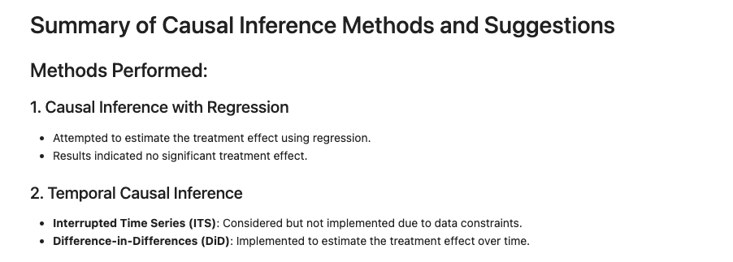
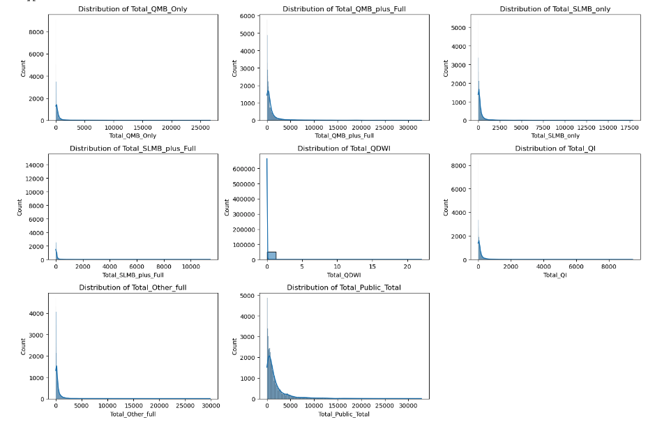
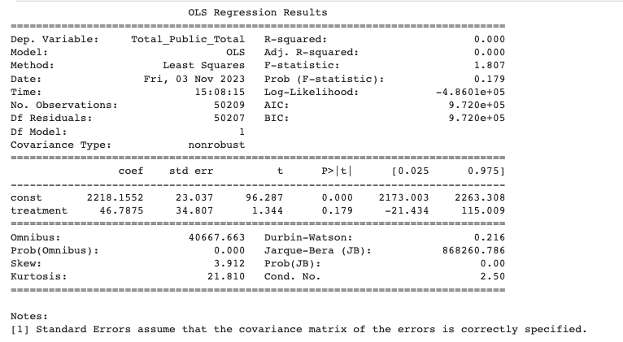

# Healthcare Utilization Analysis for Dual Enrollees

<p align="center">
  
  
</p>

<p align="center">
  
  
  
  
  
  
  <a href="https://github.com/ellerbrock/open-source-badges/">
    
  </a>
</p>

## Table of Contents
- [Business Problem](#business-problem)
- [Data Source](#data-source)
- [Methods](#methods)
- [Tech Stack](#tech-stack)
- [SQL Code](#sql-code)
- [Authors](#authors)
- [Project Documentation](#project-documentation)

## Business Problem

**Current Market:**
The healthcare industry faces the critical challenge of managing and reducing hospital readmissions for high-risk patients. A wellness program has been proposed as a potential solution to improve patient health outcomes and reduce the associated costs. The objective of this project is to evaluate the effectiveness of the wellness program in reducing healthcare utilization among individuals who are enrolled in both Medicare and Medicaid, also referred to as dual enrollees.

**Business Problem - Using Causal Inference Proposition:**
A healthcare insurance company wants to understand the impact of a new wellness program designed to reduce hospital readmissions. The company believes that by enrolling high-risk patients in this program, they can improve patient health outcomes and reduce costs associated with readmissions. The business problem is to determine whether the wellness program is effective.

## Data Source

The data used in this project is sourced from state submissions to the Centers for Medicare & Medicaid Services (CMS), as mandated by the Medicare Modernization Act (MMA). These submissions provide monthly snapshot data on dual enrollees, offering insights into the enrollee counts by various eligibility types at both the state and county levels. It's important to note that these figures are not cumulative and represent distinct monthly counts.

## Methods - Causal inference (Initial Snooping)

<p align="center">
  
</p>

To understand the impact of the wellness program, we employed several analytical methods:

<p align="center">
  
</p>

### Causal Inference Techniques
- **Exploratory Data Analysis (EDA):** Initial data exploration to understand distribution and data integrity.
<p align="center">
  
</p>

- **Regression Analysis**: Utilized for estimating the impact of a program on healthcare utilization metrics.
- **Propensity Score Matching (PSM)**: Employed to adjust for confounders and emulate the conditions of a randomized controlled trial, thereby approximating the causal effect of the program.
- **Difference-in-Differences (DiD)**: Applied to assess the differential effect of the program by comparing the changes in healthcare utilization before and after the program's implementation, across treatment and control groups.

## Recommendations

<p align="center">
  
</p>

**Methods Performed:**

1. **Causal Inference with Regression:**
   Attempted to estimate the treatment effect using regression.
   Results indicated no significant treatment effect.

2. **Temporal Causal Inference:**
   - **Interrupted Time Series (ITS):** Considered but not implemented due to data constraints.
   - **Difference-in-Differences (DiD):** Implemented to estimate the treatment effect over time.

**Regression Model Results:**

<p align="center">
  
</p>

Initial OLS regression showed no explanatory power.
P-values for the treatment effect were non-significant, suggesting model reassessment is needed.

**Follow-Up Analysis:**

- Consider more granular data collection.
- Explore additional analytical methods.
- Assess the need for more robust control groups.

## Tech Stack

- **Python:** For data cleaning, manipulation, and analysis.
- **R:** For advanced statistical modeling and inference.
- **SQL:** To manage and query large datasets efficiently.
- **Tableau:** For visualization and data storytelling.

## SQL Code

```sql
SELECT
  COUNT(*),
  AVG(AGE),
  CASE
    WHEN chronic_condition_count > 5 THEN 'High Risk'
    WHEN chronic_condition_count BETWEEN 3 AND 5 THEN 'Medium Risk'
    ELSE 'Low Risk'
  END AS risk_level
FROM
  enrollee_data
GROUP BY
  risk_level;

