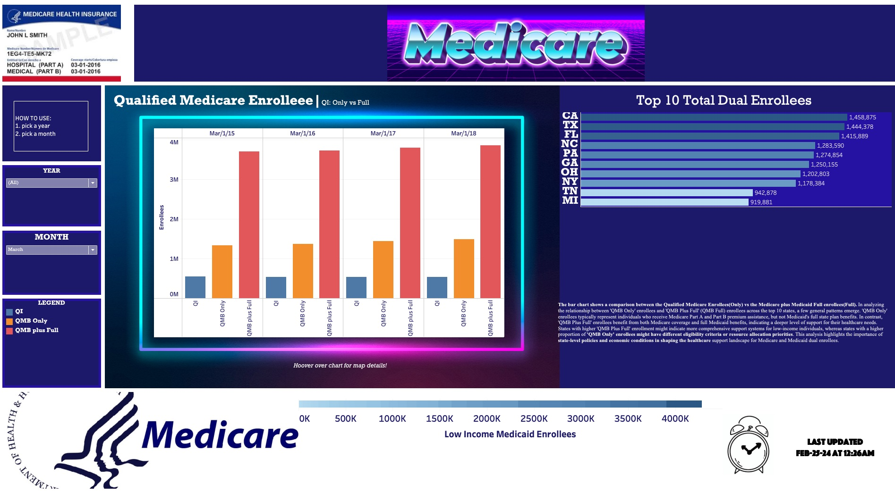

# Healthcare

<p align="center">
  
  
</p>

<p align="center">
  
  
  
  
</p>

<p>
    Badge <a href="https://shields.io/">Source</a>
  </p>


<p>
  <h2>Authors</h2>
  <ul>
    <li><a href="https://github.com/dsrichard97">@dsrichard97</a></li>
  </ul>
</p>

## Table of Contents
- [Business Problem](#business-problem)
- [SQL Code](#sql-code)
- [Data Source](#data-source)
- [Methods](#methods)
- [Tech Stack](#tech-stack)
- [Quick Glance at the Results](#results)
- [Lessons learned and Recommendation](#lessons)
- [Resources](#resources)

## Business Problem

**Context in the Healthcare Sector:**
This project evaluates the effectiveness of a wellness program in reducing healthcare utilization among Medicare and Medicaid dual enrollees, aiming to improve patient health outcomes and decrease costs. It seeks to provide a detailed analysis of dual enrollees through a causal inference approach, delivering insights for businesses to refine marketing and retention strategies.

**Business Challenge:**
Conduct data snooping to investigate possible models to use. 

## Data Source

**Data Origin and Regulatory Background:** 

The data for this project is derived from submissions made by states to the Centers for Medicare & Medicaid Services (CMS), as required under the Medicare Modernization Act (MMA). These submissions are stored in the form of monthly data on individuals enrolled in both Medicare and Medicaid(Dual Enrollees).


## SQL Code

```sql
WITH CleanedData AS (
    SELECT 
        State_Abbr,
        County_Name,
        Date,
        COALESCE(QMB_Only, 0) AS Total_QMB_Only, --using COALESCE to fill with 0 for null values
        COALESCE(QMB_plus_Full, 0) AS Total_QMB_plus_Full,
        COALESCE(SLMB_only, 0) AS Total_SLMB_only,
        COALESCE(SLMB_plus_Full, 0) AS Total_SLMB_plus_Full,
        COALESCE(QDWI, 0) AS Total_QDWI,
        COALESCE(QI, 0) AS Total_QI,
        COALESCE(Other_full, 0) AS Total_Other_full,
        COALESCE(Public_Total, 0) AS Total_Public_Total
    FROM 
`bigquery-public-data.sdoh_cms_dual_eligible_enrollment.dual_eligible_enrollment_by_county_and_program`
)
SELECT
    State_Abbr,
    County_Name,
    Date,
    SUM(Total_QMB_Only) AS Total_QMB_Only,
    SUM(Total_QMB_plus_Full) AS Total_QMB_plus_Full,
    SUM(Total_SLMB_only) AS Total_SLMB_only,
    SUM(Total_SLMB_plus_Full) AS Total_SLMB_plus_Full,
    SUM(Total_QDWI) AS Total_QDWI,
    SUM(Total_QI) AS Total_QI,
    SUM(Total_Other_full) AS Total_Other_full,
    SUM(Total_Public_Total) AS Total_Public_Total
FROM
    CleanedData
GROUP BY
    State_Abbr,
    County_Name,
    Date
ORDER BY
    State_Abbr,
    County_Name,
    Date;
```

Frome the previous code we can generate a sample data: [Click here for data](https://github.com/dsrichard97/Medicare_Dual_Enroll/blob/main/dual.csv) .

## Methods - Causal inference (Initial Snooping)
<p>
    <ul>
      <li>Business Problem</li>
      <li>SQL Code</li>
      <li>Initial EDA</li>
      <li>Tableau Dashboard</li>
      <li>PowerPoint</li>
    </ul>
</p>

## Tech Stack
<p>
    <ul>
      <li>Google Cloud(Google BigQuery)</li>
      <li>Python</li>
      <li>Tableau</li>
    </ul>
  </p>

## Results
Enrollments over time for each measure


  
Top 10 Counties


Distributions


Tableau Visuals

- To Visit Link: [TABLEAU](https://public.tableau.com/views/MEDICARE_17047605414730/Medicare?:language=en-US&:sid=&:display_count=n&:origin=viz_share_link)


In addressing the business challenge to evaluate the effectiveness of a wellness program for Medicare and Medicaid dual enrollees, our data snooping efforts have yielded insightful results. By examining enrollment trends for 'SLMB Only', 'QMB Only', and 'QI' within Jefferson County, we observed distinct patterns that suggest a significant impact of the wellness program on healthcare utilization. With 'QI' enrollments relatively stable around 9,000, 'SLMB Only' close to 5,000, and 'QI' again near 3,000, the data points towards a varying degree of engagement across different segments of the dual enrollee population. These findings, set against the backdrop of Jefferson County's diverse demographic and healthcare landscape, underline the potential of targeted wellness programs to not only enhance patient health outcomes but also to strategically reduce costs. The distinct enrollment numbers across programs highlight areas where the wellness initiative is either thriving or requires further adaptation to meet enrollee needs more effectively. This analysis provides a foundation for businesses to refine marketing and retention strategies, focusing on personalized approaches to maximize the wellness program's impact on dual enrollees' **health management** and **cost containment**.

Further analysis reveals a noteworthy predominance of Qualified Medicare Beneficiaries (Full Medicaid Enrollees) within our data, particularly from 2015 to 2019, with Jefferson, Mobile, and Montgomery counties emerging as the top three contributors in the United States. Specifically, in Jefferson County, we find that 'QMB Only' enrollees represent the majority, followed by 'SLMB Only' enrollees, and then 'QI' enrollments. This pattern underscores the critical role these counties play in the broader context of healthcare utilization among dual enrollees. The success of our exploratory data analysis (EDA) in providing targeted insights into this specific group paves the way for further investigation through temporal trends, demographic analysis, and geographical distribution models. Such focused analyses promise to deepen our understanding of enrollment behaviors and the wellness program's effectiveness, offering valuable perspectives for tailoring future health initiatives and business strategies.
FOR FULL PROJECT: [EDA](https://github.com/dsrichard97/Medicare_Dual_Enroll/blob/main/Healthcare_EDA.ipynb)


## Lessons


The exploration of data, despite its inherent complexities, underscores the crucial role of a skilled team in translating insights into actionable outcomes. Engaging in exploratory data analysis (EDA) has highlighted the power of visual storytelling and strategic reporting in uncovering hidden patterns and informing decision-making processes. However, the pursuit of further data-driven inquiries must align with the overarching goal of fostering business growth and providing actionable solutions. As a statistician, it is imperative to combine analytical expertise with effective communication to create compelling results for team or client.


## Resources
- [PowerPoint](https://csulb-my.sharepoint.com/:p:/g/personal/richard_diazdeleon01_student_csulb_edu/EYy-nyChep5EqCPcvolVEsgBXFeoiqrH0wkjYPoxnf7QZA?e=k2u6kt)
- [TABLEAU](https://public.tableau.com/views/MEDICARE_17047605414730/Medicare?:language=en-US&:sid=&:display_count=n&:origin=viz_share_link)
- [Healthcare EDA notebook](https://github.com/dsrichard97/Medicare_Dual_Enroll/blob/main/Healthcare_EDA.ipynb).
- [High Level Overview](https://github.com/dsrichard97/Medicare_Dual_Enroll/blob/main/hleveldualenroll.vsdx)

