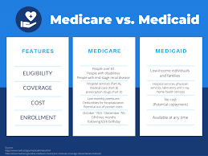
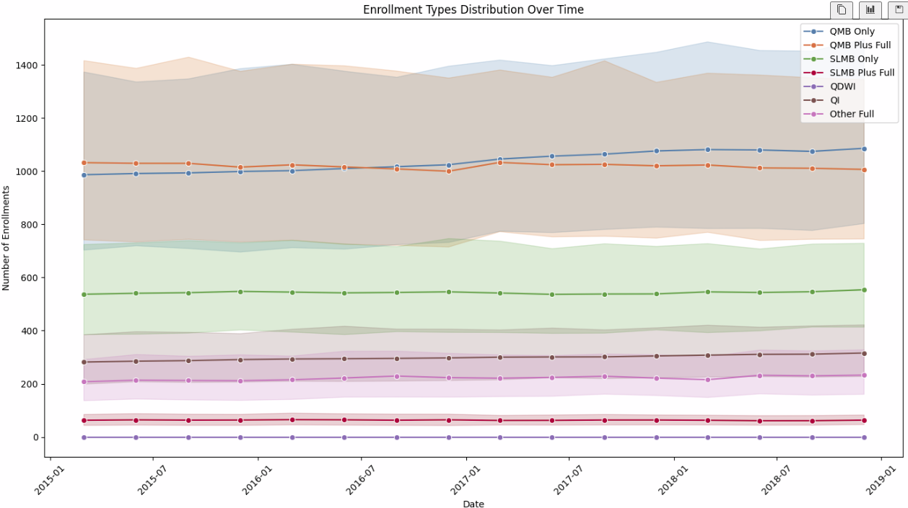
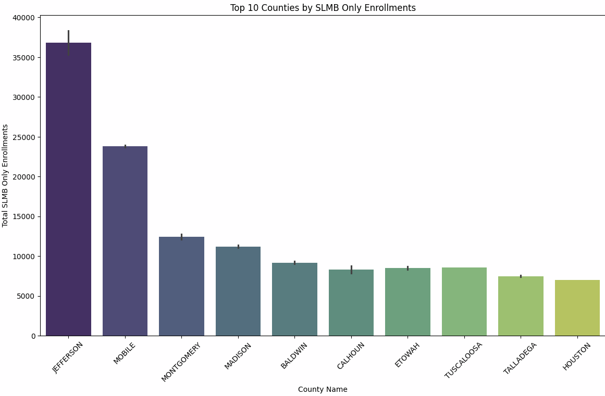
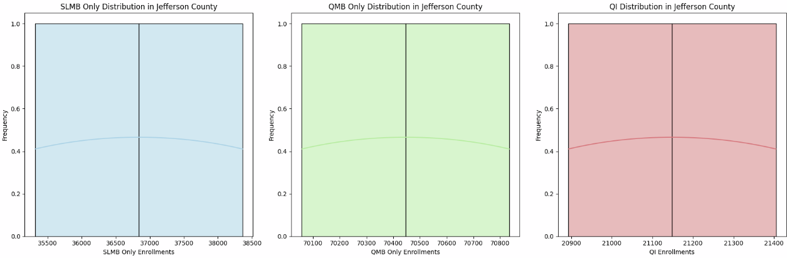

# Healthcare

<p align="center">
  
  
</p>

<p align="center">
  
  
  
  
  </a>
</p>

<p>
    Badge <a href="https://shields.io/">Source</a>
  </p>
</p>

<p>
  <h2>Authors</h2>
  <ul>
    <li><a href="https://github.com/dsrichard97">@dsrichard97</a></li>
  </ul>
</p>

## Table of Contents
- [Business Problem](#business-problem)
- [SQL Code](#sql-code)
- [Data Source](#data-source)
- [Methods](#methods)
- [Tech Stack](#tech-stack)
- [Quick Glance at the Results](#results)
- [Lessons learned and Recommendation](#lessons)
- [Resources](#resources)

## Business Problem

**Context in the Healthcare Sector:**
This project evaluates the effectiveness of a wellness program in reducing healthcare utilization among Medicare and Medicaid dual enrollees, aiming to improve patient health outcomes and decrease costs. It seeks to provide a detailed analysis of dual enrollees through a causal inference approach, delivering insights for businesses to refine marketing and retention strategies.

**Business Challenge:**
Conduct data snooping to investigate possible models to use. 

## Data Source

**Data Origin and Regulatory Background:** 

The data for this project is derived from submissions made by states to the Centers for Medicare & Medicaid Services (CMS), as required under the Medicare Modernization Act (MMA). These submissions are stored in the form of monthly data on individuals enrolled in both Medicare and Medicaid(Dual Enrollees).


## SQL Code

```sql
WITH CleanedData AS (
    SELECT 
        State_Abbr,
        County_Name,
        Date,
        COALESCE(QMB_Only, 0) AS Total_QMB_Only, --using COALESCE to fill with 0 for null values
        COALESCE(QMB_plus_Full, 0) AS Total_QMB_plus_Full,
        COALESCE(SLMB_only, 0) AS Total_SLMB_only,
        COALESCE(SLMB_plus_Full, 0) AS Total_SLMB_plus_Full,
        COALESCE(QDWI, 0) AS Total_QDWI,
        COALESCE(QI, 0) AS Total_QI,
        COALESCE(Other_full, 0) AS Total_Other_full,
        COALESCE(Public_Total, 0) AS Total_Public_Total
    FROM 
`bigquery-public-data.sdoh_cms_dual_eligible_enrollment.dual_eligible_enrollment_by_county_and_program`
)
SELECT
    State_Abbr,
    County_Name,
    Date,
    SUM(Total_QMB_Only) AS Total_QMB_Only,
    SUM(Total_QMB_plus_Full) AS Total_QMB_plus_Full,
    SUM(Total_SLMB_only) AS Total_SLMB_only,
    SUM(Total_SLMB_plus_Full) AS Total_SLMB_plus_Full,
    SUM(Total_QDWI) AS Total_QDWI,
    SUM(Total_QI) AS Total_QI,
    SUM(Total_Other_full) AS Total_Other_full,
    SUM(Total_Public_Total) AS Total_Public_Total
FROM
    CleanedData
GROUP BY
    State_Abbr,
    County_Name,
    Date
ORDER BY
    State_Abbr,
    County_Name,
    Date;
```

Frome the previous code we can generate a sample data: [Click here for data](https://github.com/dsrichard97/Medicare_Dual_Enroll/blob/main/dual.csv) .

## Methods - Causal inference (Initial Snooping)
<p>
    <ul>
      <li>Business Problem</li>
      <li>SQL Code</li>
      <li>Python Report(EDA)</li>
      <li>Tableau Dashboard</li>
      <li>PowerPoint</li>
    </ul>
  </section>
</p>

## Tech Stack
<p>
    <ul>
      <li>Google Cloud(Google BigQuery)</li>
      <li>SQL</li>
      <li>Python</li>
      <li>Tableau</li>
    </ul>
  </p>

## Results
Enrollments over time for each measure
<p>
  
</p>
Top 10 Counties
<p>
  
</p>
Distributions
<p>
  
</p>

From the results, we can notice that from the data that there is a lot of number of qualified Meicare Benificaries(Full Medicaid Enrolles) most of our data. In terms of specifics, we notice that Jefferson county, Mobile, and Montogomery counties are the top 3 leading counties in the United States from 2015-2019. In terms of Jefferson county, we can see that on average we have QMB Only Enrollees(Highest), SLMB Enrollees, and QI enrollments that make up for most of our members in Jefferson County. The data snooping in general was a success becuase the EDA gave us good insights on a specific targeted group.

## Lessons


## Resources
- [PowerPoint](https://csulb-my.sharepoint.com/:p:/g/personal/richard_diazdeleon01_student_csulb_edu/EYy-nyChep5EqCPcvolVEsgBXFeoiqrH0wkjYPoxnf7QZA?e=k2u6kt)
- [TABLEAU](https://public.tableau.com/views/MEDICARE_17047605414730/Dashboard1?:language=en-US&:display_count=n&:origin=viz_share_link)
- [Healthcare EDA notebook](https://github.com/dsrichard97/Medicare_Dual_Enroll/blob/main/Healthcare_EDA.ipynb).
- [High Level Overview](https://github.com/dsrichard97/Medicare_Dual_Enroll/blob/main/hleveldualenroll.vsdx)

