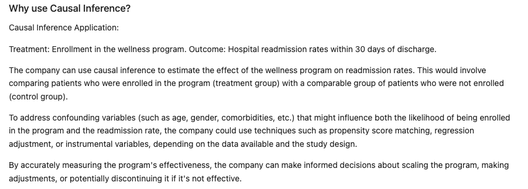
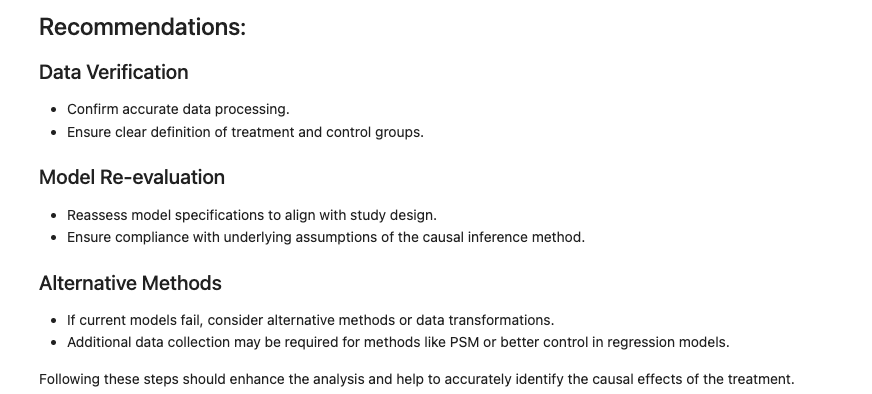

# Healthcare Utilization Analysis for Dual Enrollees

<div align="center">
  
  
</div>

<div align="center">
  
  
  
  
  
  
  <a href="https://github.com/ellerbrock/open-source-badges/">
    
  </a>
</div>

## Table of Contents
- [Introduction](#introduction)
- [Business Problem](#business-problem)
- [Data Source](#data-source)
- [Methodology](#methodology)
- [Causal Inference Techniques](#causal-inference-techniques)
- [Recommendations](#recommendations)
- [SQL Queries](#sql-queries)
- [Tech Stack](#tech-stack)
- [Authors](#authors)
- [Project Documentation](#project-documentation)

## Introduction
<p align="justify">
The healthcare industry is facing the critical challenge of managing and reducing hospital readmissions for high-risk patients. This project aims to evaluate the effectiveness of a wellness program in reducing healthcare utilization among dual enrollees in Medicare and Medicaid, using a rigorous data-driven approach.
</p>

## Business Problem
<p align="justify">
A healthcare insurance company seeks to understand the impact of a new wellness program aimed at reducing hospital readmissions. By analyzing patient data, the company aims to improve health outcomes and reduce costs, establishing the efficacy of the program.
</p>

## Data Source
<p align="justify">
Data for this analysis is sourced from state submissions to the Centers for Medicare & Medicaid Services (CMS), providing valuable insights into enrollee counts by eligibility types on a monthly basis.
</p>

## Methodology
<div align="center">
  
</div>

## Causal Inference Techniques
- **Regression Analysis:** Estimating program impact on healthcare utilization.
- **Propensity Score Matching (PSM):** Simulating randomized control trials to control confounding variables.
- **Difference-in-Differences (DiD):** Assessing pre- and post-program changes in utilization.

## Recommendations
<div align="center">
  
</div>

## SQL Queries
```sql
-- Example SQL query to analyze healthcare data
SELECT patient_id, program_enrollment, hospital_visits
FROM healthcare_utilization
WHERE program_enrollment = 'Wellness Program'
GROUP BY patient_id
ORDER BY hospital_visits DESC;
