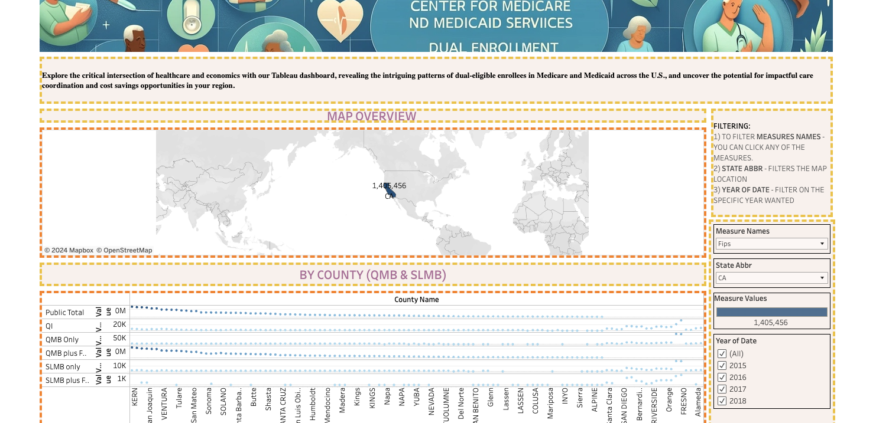

# Healthcare Utilization Analysis for Dual Enrollees

<p align="center">
  
  
</p>

<p align="center">
  
  
  
  
  
  
  
  <a href="https://github.com/ellerbrock/open-source-badges/">
    
  </a>
</p>

## Table of Contents
- [Business Problem](#business-problem)
- [Data Source](#data-source)
- [Methods](#methods)
- [Tech Stack](#tech-stack)
- [Project Documentation](#project-documentation)
- [SQL Code](#sql-code)
- [Resources](#resources)

## Business Problem

**Context in the Healthcare Sector:**
The healthcare industry currently grapples with the significant issue of reducing hospital readmissions, particularly for high-risk patients. A wellness program has been suggested as a potential strategy to enhance patient health outcomes while concurrently cutting down on related expenses. This project's goal is to assess how effective the wellness program is in diminishing healthcare usage among individuals who participate in both Medicare and Medicaid, often known as dual enrollees.

**Business Challenge - Leveraging Causal Inference for Strategic Insights:**
Gaining a deeper understanding of dual enrollees is crucial for businesses, especially in strategizing marketing efforts to attract new memberships. Typically, account managers or sales teams work on a contractual basis with businesses. In some cases, they focus on tracking specific members to not only boost memberships but also to develop more effective marketing strategies. This project aims to provide a comprehensive overview of dual enrollees from a causal inference standpoint, offering valuable insights for targeted business strategies.

## Data Source

**Data Origin and Regulatory Background:** 

The data for this project is derived from submissions made by states to the Centers for Medicare & Medicaid Services (CMS), as required under the Medicare Modernization Act (MMA). These submissions are a critical source of information, as they furnish monthly snapshot data on individuals enrolled in both Medicare and Medicaid.

**Nature of the Data:** 

The provided data offers valuable insights into the number of dual enrollees, categorized by various eligibility criteria at both state and county levels. A crucial aspect to understand is that these numbers are not cumulative; they represent unique counts for each month. This distinction is vital for accurate analysis and interpretation of trends over time.


## SQL Code

```sql
WITH CleanedData AS (
    SELECT 
        State_Abbr,
        County_Name,
        Date,
        COALESCE(QMB_Only, 0) AS Total_QMB_Only, --using COALESCE to fill with 0 for null values
        COALESCE(QMB_plus_Full, 0) AS Total_QMB_plus_Full,
        COALESCE(SLMB_only, 0) AS Total_SLMB_only,
        COALESCE(SLMB_plus_Full, 0) AS Total_SLMB_plus_Full,
        COALESCE(QDWI, 0) AS Total_QDWI,
        COALESCE(QI, 0) AS Total_QI,
        COALESCE(Other_full, 0) AS Total_Other_full,
        COALESCE(Public_Total, 0) AS Total_Public_Total
    FROM 
`bigquery-public-data.sdoh_cms_dual_eligible_enrollment.dual_eligible_enrollment_by_county_and_program`
)
SELECT
    State_Abbr,
    County_Name,
    Date,
    SUM(Total_QMB_Only) AS Total_QMB_Only,
    SUM(Total_QMB_plus_Full) AS Total_QMB_plus_Full,
    SUM(Total_SLMB_only) AS Total_SLMB_only,
    SUM(Total_SLMB_plus_Full) AS Total_SLMB_plus_Full,
    SUM(Total_QDWI) AS Total_QDWI,
    SUM(Total_QI) AS Total_QI,
    SUM(Total_Other_full) AS Total_Other_full,
    SUM(Total_Public_Total) AS Total_Public_Total
FROM
    CleanedData
GROUP BY
    State_Abbr,
    County_Name,
    Date
ORDER BY
    State_Abbr,
    County_Name,
    Date;
```


**Data Processing and Analysis Tools:**

For data processing and analysis, SQL code is utilized, specifically leveraging the capabilities of Google BigQuery. Google BigQuery's robust platform allows for efficient handling and analysis of large datasets, making it an ideal tool for extracting meaningful patterns and conclusions from the CMS data. For a sample of the raw data: https://github.com/dsrichard97/Medicare_Dual_Enroll/blob/main/dual.csv

## Methods - Causal inference (Initial Snooping)

<p align="center">
  
</p>

To understand the impact of the wellness program, we employed several analytical methods:

<p align="center">
  
</p>

### Causal Inference Techniques
<p align="center">
  
</p>

- 1. Exploratory Data Analysis (EDA): This is the initial phase where the data is explored to understand its distribution and verify its integrity. EDA involves visualizing, summarizing, and interpreting the characteristics of the data. This step is crucial for identifying patterns, anomalies, and forming hypotheses about the relationships within the data.

- 2. Regression Analysis: This technique is instrumental in estimating the impact of the wellness program on healthcare utilization metrics. Regression analysis helps in understanding the relationship between independent variables (like program participation) and dependent variables (such as healthcare utilization rates), controlling for other factors.

- 3. Propensity Score Matching (PSM): PSM is a statistical technique used to create a synthetic control group by matching participants of the wellness program with non-participants having similar characteristics. This approach helps to adjust for confounding variables that could bias the results and simulates the conditions of a randomized controlled trial. The goal is to approximate the causal effect of the wellness program on dual enrollees.

- 4. Difference-in-Differences (DiD): The DiD method is used to assess the program's differential impact by comparing the changes in healthcare utilization metrics before and after its implementation. This comparison is made across both the groups that participated in the program (treatment group) and those that did not (control group). This method helps to isolate the effect of the program by factoring out other variables that could affect healthcare utilization.

## Recommendations

<p align="center">
  
</p>

**Methods Performed:**

-> **1. Causal Inference with Regression**

Objective: The primary aim was to estimate the treatment effect of the wellness program using regression analysis.

Outcome: The results from this method indicated that there was no significant treatment effect. This could imply that the program did not have a measurable impact on healthcare utilization metrics for dual enrollees, or that the effect was too subtle to be captured through this method.
Temporal Causal Inference Techniques

-> **2. Interrupted Time Series (ITS)**
Consideration: This method was considered for its potential to analyze the effect of interventions over time by examining data points before and after the implementation of the program.

Decision: Ultimately, ITS was not implemented due to data constraints. Such constraints could include insufficient time points, lack of granularity in the data, or other limitations that hinder the effective application of ITS.

-> **3. Difference-in-Differences (DiD)**
Implementation: DiD was employed to estimate the treatment effect over time. This method is advantageous in observational studies where random assignment is not feasible. It compares the changes in outcomes over time between a group that received the treatment (enrolled in the wellness program) and a control group (not enrolled).

**Regression Model Results:**

<p align="center">
  
</p>

**Outcome of Initial OLS Regression:**

- Explanatory Power: The initial Ordinary Least Squares (OLS) regression analysis demonstrated no significant explanatory power in terms of the relationship between the wellness program and healthcare utilization metrics.

- Significance of Treatment Effect: The p-values for the treatment effect were non-significant, which indicates that, as per this model, the wellness program did not have a statistically significant impact on the outcomes being measured.

- Implication: Such results necessitate a reassessment of the model. Non-significant results could be due to various factors such as model misspecification, inadequate control variables, or insufficient data.
Recommendations for Follow-Up Analysis

- Granular Data Collection: Consider collecting more detailed data. Granularity could provide deeper insights, especially if there are subtle effects of the program that broader data might not capture. This could involve gathering more specific data points or extending the timeframe of data collection.
- Exploration of Additional Analytical Methods: Given the initial results, exploring other analytical methods might be beneficial. Techniques like logistic regression, survival analysis, or machine learning models could offer alternative insights, particularly in understanding complex relationships or interactions within the data.

- Assessment for More Robust Control Groups: Re-evaluating the control groups used in the analysis is crucial. Ensuring that the control group closely matches the treatment group in all aspects except for the treatment itself (enrollment in the wellness program) is key for causal inference. Techniques like propensity score matching or using more advanced matching algorithms could help in creating more robust control groups.


In summary, the initial OLS regression results suggest that the model needs refinement or a different analytical approach. By focusing on more granular data, exploring alternative methods, and ensuring the use of robust control groups, you may be able to derive more meaningful insights and better understand the impact of the wellness program on dual enrollees.

**TEABLEAU VISUALS:**
<p align="center">
  

  Click on the <b>RESOURCES LINK</b> down below to see the interactive Tableau dashboard.
</p>

## Tech Stack
- **Data Wrangling and Analysis:** `Python` with `pandas`, `numpy`, and `statsmodels` for data manipulation and statistical modeling.
- **Data Visualization:** `matplotlib` and `seaborn` for generating informative plots and graphs. [Tableau](https://public.tableau.com/views/MedicareDualEnrollment2015-18/Dashboard3?:language=en-US&:display_count=n&:origin=viz_share_link)
- **Version Control:** `Git` for tracking changes and collaborative development.
- **Hosting/Repository:** `GitHub` for hosting the project repository and documentation.


## Resources
- [PowerPoint](https://csulb-my.sharepoint.com/:p:/g/personal/richard_diazdeleon01_student_csulb_edu/EYy-nyChep5EqCPcvolVEsgBXFeoiqrH0wkjYPoxnf7QZA?e=k2u6kt)
- [TABLEAU](https://public.tableau.com/views/MEDICARE_17047605414730/Dashboard1?:language=en-US&:display_count=n&:origin=viz_share_link)
- [Healthcare EDA notebook](https://github.com/dsrichard97/Medicare_Dual_Enroll/blob/main/Healthcare_EDA.ipynb).
- [High Level Overview](https://github.com/dsrichard97/Medicare_Dual_Enroll/blob/main/hleveldualenroll.vsdx)

